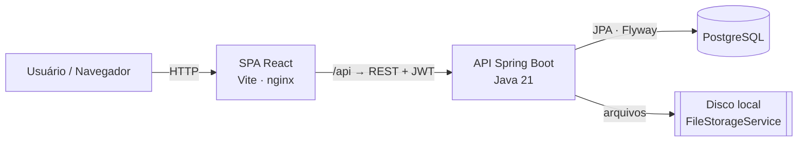
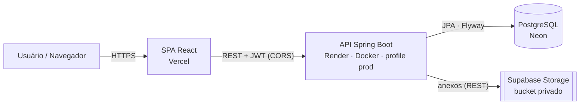

# FraternityOS

> Uma plataforma web para gerenciar as operações de uma república — membros, cargos, avisos, calendário compartilhado, tarefas e demonstrativos de aluguel mensais — substituindo o fluxo de WhatsApp + planilhas por um único painel.

<!-- Atualize owner/repo se o seu remoto for diferente. -->


O FraternityOS é uma aplicação full-stack: uma API REST em **Spring Boot** e uma SPA em **React** separada. A autenticação é baseada em JWT e a autorização é **derivada dos cargos** que um membro possui (Presidente / Tesoureiro concedem permissões). A interface está em **português (BR)**.

---

## 📸 Capturas de tela


| Painel | Calendário |
|---|---|
|  |  |

| Responsabilidades | Finanças |
|---|---|
|  |  |

---

## 🏗 Arquitetura

Duas camadas: uma SPA React conversa com a API Spring Boot via REST usando um token JWT (bearer). Sem SSR, sem servidor compartilhado. Em produção a SPA é servida pelo nginx, que também faz proxy de `/api` para o backend.



- **Autorização derivada de cargos** — não há coluna `role`; o JWT carrega os nomes dos cargos e um filtro mapeia `President → ROLE_PRESIDENT`, `Treasurer → ROLE_TREASURER`, qualquer membership → `ROLE_RESIDENT`. Os endpoints são protegidos com `@PreAuthorize`.
- **Multitenancy** — toda linha de domínio pertence a uma `HOUSE` e referencia uma `MEMBERSHIP`; as consultas são escopadas por `house_id`, derivado do principal autenticado (nunca da entrada do cliente).
- **DDD leve** — pacote por bounded context, cada um dividido em `domain` / `application` / `infrastructure` / `api`; as dependências apontam para dentro.

Veja [`project-scope.md`](project-scope.md) para a especificação do produto e o modelo de dados completo, e [`CLAUDE.md`](CLAUDE.md) para arquitetura e convenções de código.

---

## ✨ Funcionalidades

- ✅ **Autenticação JWT** — cadastro próprio (apenas conta), login com e-mail/senha, tokens HS256 stateless
- ✅ **RBAC** — cargos derivados de posições (Presidente / Tesoureiro / Residente) aplicados com `@PreAuthorize`
- ✅ **Onboarding** — criar uma república (virar Presidente) ou solicitar entrada → aprovação do Presidente
- ✅ **Gestão de membros** — membros ativos e ex-membros, atribuir/remover cargos do catálogo, mudança de status (exclusão suave = aposentar), aprovação de solicitações de entrada, invariante "sempre ao menos um Presidente ativo"
- ✅ **Avisos** — mural de notícias da república com fixação (Presidente publica, todos leem)
- ✅ **Calendário** — calendário mensal compartilhado (Presidente edita, residentes leem)
- ✅ **Tarefas / Responsabilidades** — quadro Pendentes / Atrasadas / Concluídas; status ATRASADA derivado na leitura
- ✅ **Finanças** — o Tesoureiro envia um demonstrativo de aluguel mensal (PDF/imagem) que gera um pagamento PENDENTE para cada membro ativo; cada membro marca o seu como pago

---

## 🧰 Tecnologias

**Backend**
- Java 21 · Spring Boot 3.5 · Spring Data JPA · Spring Security + JWT (jjwt)
- PostgreSQL · migrações **Flyway** · Maven
- Uploads de arquivo em disco local por trás de um `FileStorageService` (substituível por S3)

**Frontend**
- React 19 · **TypeScript** · Vite · React Router · TanStack Query
- Tailwind CSS v4 · Shadcn/UI · axios

**Testes & DevOps**
- **JUnit 5** + Mockito (unitário) · **Testcontainers** PostgreSQL (integração + repositório)
- **Docker** (imagem multi-stage do backend, imagem nginx do frontend, `docker-compose`)
- CI com **GitHub Actions** (testes · lint · build das imagens)

_Planejado:_ documentação OpenAPI/Swagger, um worker `@Scheduled` para tarefas rotativas, notificações.

---

## 🚀 Como começar

### Pré-requisitos
- **Docker** (Desktop ou Engine) — necessário para o stack completo e para os testes com Testcontainers do backend
- Para desenvolvimento local sem containers: **Java 21**, **Node 22+**

### Opção A — Rodar tudo com Docker Compose

```bash
# a partir da raiz do repositório
cp .env.example .env          # depois defina um JWT_SECRET forte
docker compose up --build
```

- Frontend → http://localhost:5173
- Backend  → http://localhost:8080
- PostgreSQL → localhost:5432 (`fraternityos` / `postgres` / `postgres`)

### Opção B — Desenvolvimento local (hot reload)

```bash
# 1. Banco de dados
docker compose up -d postgres

# 2. Backend (a partir de server/) — o Flyway migra ao iniciar
cd server && ./mvnw spring-boot:run

# 3. Frontend (a partir de frontend/) — o Vite faz proxy de /api → :8080
cd frontend && npm install && npm run dev
```

Depois abra http://localhost:5173, **cadastre-se** e crie uma república (você vira Presidente) ou solicite entrada em uma existente.

### Variáveis de ambiente

Copie `.env.example` para `.env` (o docker-compose lê automaticamente). Todas têm um padrão local seguro, então o stack sobe sem configuração; sobrescreva para produção.

| Variável | Padrão | Descrição |
|---|---|---|
| `SPRING_PROFILES_ACTIVE` | `prod` (no compose) | `prod` lê tudo de env (`application-prod.yml`) e falha rápido se faltar algo. Dev local sem container usa o profile `default`. |
| `POSTGRES_DB` / `POSTGRES_USER` / `POSTGRES_PASSWORD` | `fraternityos` / `postgres` / `postgres` | Credenciais do Postgres do compose. |
| `SPRING_DATASOURCE_URL` / `_USERNAME` / `_PASSWORD` | Postgres do compose | Datasource do backend; aponte para um banco externo em produção. |
| `JWT_SECRET` | segredo de dev (emite aviso) | **Segredo de assinatura JWT — valor forte e único ≥32 bytes em produção.** Sem ele, o profile `prod` não inicia. |
| `JWT_EXPIRATION_MS` | `86400000` (24h) | Validade do token. |
| `CORS_ALLOWED_ORIGINS` | *(vazio)* | Origens permitidas (separadas por vírgula). Vazio = sem CORS (mesma origem via proxy). **Nunca use `*` em produção.** |
| `FILE_STORAGE_DIR` | `/app/uploads` | **Dev/local:** diretório dos anexos dos demonstrativos (profile `default`). |
| `SUPABASE_URL` | *(sem padrão)* | **Produção:** URL do projeto Supabase, ex.: `https://abcxyz.supabase.co`. Obrigatória no profile `prod`. |
| `SUPABASE_STORAGE_BUCKET` | `statements` | **Produção:** bucket **privado** do Supabase Storage para os anexos. |
| `SUPABASE_SERVICE_KEY` | *(sem padrão)* | **Produção — Segredo.** Chave secreta do Supabase (`sb_secret_...` ou `service_role`). Apenas backend; nunca faça commit nem exponha ao navegador. |
| `VITE_API_URL` | *(vazio → `/api`)* | URL base da API no build do frontend. Defina absoluta só se a API estiver em outra origem. |
| `JAVA_OPTS` | *(vazio)* | Flags extras da JVM, ex.: `-XX:MaxRAMPercentage=75`. |

### Produção

O backend tem um profile de produção (`application-prod.yml`) que lê **toda** a configuração sensível de variáveis de ambiente e **falha rápido** se algum valor obrigatório faltar — nenhum segredo é gravado na imagem ou no repositório.

Em produção os anexos dos demonstrativos são guardados num bucket **privado** do **Supabase Storage** (`SupabaseFileStorageService`), e não em disco local — assim sobrevivem a redeploys/reinícios em hosts com filesystem efêmero (ex.: Render). Em dev/local o profile `default` continua usando disco local (`FILE_STORAGE_DIR`), sem precisar do Supabase.

```bash
# 1. Configure os segredos (nunca faça commit do .env)
cp .env.example .env
#   defina JWT_SECRET (ex.: openssl rand -base64 48), o datasource de produção,
#   e CORS_ALLOWED_ORIGINS se o frontend estiver em outra origem.

# 2. Suba o stack (o compose já usa SPRING_PROFILES_ACTIVE=prod por padrão)
docker compose up --build -d
```

- O backend expõe `GET /actuator/health` para probes (o container tem `HEALTHCHECK`, e o frontend só sobe quando o backend está *healthy*).
- O **Flyway migra automaticamente** ao iniciar; o Hibernate roda em `ddl-auto=validate`.
- Imagens: backend multi-stage em **JRE Alpine** (não-root), frontend em **nginx** servindo o build estático e fazendo proxy de `/api`.

> Para rodar o stack de produção **na nuvem** (sem Docker Compose), veja a seção abaixo.

---

## ☁️ Deploy na nuvem (Vercel · Render · Neon · Supabase)

Em produção o app roda distribuído em quatro serviços gerenciados de camada gratuita — não há mais nginx nem `docker compose`: o frontend é servido pela Vercel e chama o backend **cross-origin** (por isso o CORS é obrigatório, não mais um proxy `/api`).



| Camada | Serviço | O que roda | Observações |
|---|---|---|---|
| Frontend | **Vercel** | build estático do Vite (`frontend/`) | Root Directory `frontend`; `vercel.json` reescreve todas as rotas para `index.html` (SPA). |
| Backend | **Render** | Web Service Docker a partir de `server/Dockerfile` | Root Directory `server`; profile `prod`; Render injeta `PORT` (a app faz bind em `${PORT:8080}`). |
| Banco | **Neon** | PostgreSQL gerenciado | Flyway migra no boot. Use a conexão **direta** (sem `-pooler`) — o pooler quebra os advisory locks do Flyway. |
| Storage | **Supabase Storage** | anexos dos demonstrativos (bucket privado `statements`) | Sobrevive a redeploys do Render (filesystem efêmero). |

### Onde vai cada variável de ambiente

As variáveis são divididas entre os dois provedores (nada de `.env` na nuvem). Segredos marcados 🔒.

**Render (backend)**

| Variável | Valor / origem |
|---|---|
| `SPRING_PROFILES_ACTIVE` | `prod` |
| `SPRING_DATASOURCE_URL` | connection string do Neon reescrita como JDBC: `jdbc:postgresql://<host>/<db>?sslmode=require` (host **direto**, sem `-pooler`) |
| `SPRING_DATASOURCE_USERNAME` | usuário do Neon |
| `SPRING_DATASOURCE_PASSWORD` 🔒 | senha do Neon |
| `JWT_SECRET` 🔒 | valor forte único, ex.: `openssl rand -base64 48` |
| `SUPABASE_URL` | URL do projeto Supabase, `https://<ref>.supabase.co` |
| `SUPABASE_STORAGE_BUCKET` | `statements` (só se o bucket tiver outro nome) |
| `SUPABASE_SERVICE_KEY` 🔒 | chave secreta do Supabase (`sb_secret_...` ou `service_role`) |
| `CORS_ALLOWED_ORIGINS` | origem exata da Vercel, ex.: `https://<app>.vercel.app` (sem `/` final, sem path) |

**Vercel (frontend)**

| Variável | Valor / origem |
|---|---|
| `VITE_API_URL` | URL do backend no Render **sem** `/api` e **sem** `/` final, ex.: `https://<api>.onrender.com`. Embutida no build — mude-a e refaça o deploy. |

### Roteiro (resumo)

1. **Neon** — criar o projeto/DB; copiar a connection string (direta).
2. **Supabase** — criar o bucket **privado** `statements`; copiar a Project URL e uma secret key.
3. **Render** — Web Service Docker (Root Directory `server`) conectado ao GitHub; preencher as variáveis acima (menos CORS); deploy → verificar `GET /actuator/health` = `{"status":"UP"}` e o Flyway aplicando `V1`/`V2` nos logs.
4. **Vercel** — importar o repo (Root Directory `frontend`), definir `VITE_API_URL`, deploy.
5. **CORS** — definir `CORS_ALLOWED_ORIGINS` no Render com a origem da Vercel; aguardar o redeploy (o CORS é lido no boot).
6. **Verificar** — cadastro, login, criação de república, e o round-trip de anexo em Finanças (upload → download) confirmando o Supabase Storage.

> As camadas gratuitas hibernam quando ociosas: o backend no Render e o banco no Neon fazem *cold start* na primeira requisição após inatividade (alguns segundos).

---

## 💻 Dev vs. Produção

O mesmo código roda nos dois ambientes; o que muda é o **profile do Spring** e de onde vêm os serviços de apoio.

| | Desenvolvimento | Produção (nuvem) |
|---|---|---|
| Profile Spring | `default` (`application.yml`) | `prod` (`application-prod.yml`, tudo por env, *fail-fast*) |
| Como sobe | `docker compose up` **ou** `mvnw spring-boot:run` + `npm run dev` | Render (backend) + Vercel (frontend) |
| Frontend → backend | proxy same-origin (`/api` via Vite/nginx) | cross-origin direto (`VITE_API_URL`) + **CORS** |
| Banco | Postgres em container | Neon |
| Anexos | disco local (`FILE_STORAGE_DIR`) via `LocalDiskFileStorageService` | Supabase Storage via `SupabaseFileStorageService` |
| Segredos | `.env` local (padrões seguros) | env vars do Render/Vercel (nunca versionadas) |

A troca de storage é transparente para o código: ambos implementam `FileStorageService` e são selecionados por `@Profile` (`!prod` → disco local, `prod` → Supabase), sem nenhuma mudança nos callers.

---

## 🔌 Visão geral da API

Todas as rotas exigem um token `Bearer`, exceto `POST /auth/register` e `POST /auth/login`.

| Área | Endpoints |
|---|---|
| **Autenticação** | `POST /auth/register`, `POST /auth/login`, `GET /me` |
| **Repúblicas / Onboarding** | `GET /houses`, `GET /houses/search?name=`, `GET /houses/current`, `POST /houses`, `POST /houses/{id}/join-request`, `GET /houses/join-requests/mine`, `GET /houses/join-requests`, `POST /houses/join-requests/{id}/approve\|reject` |
| **Membros** | `GET /members`, `GET /members/alumni`, `GET /members/{id}`, `POST /members`, `PUT /members/{id}`, `DELETE /members/{id}`, `PATCH /members/{id}/status`, `POST /members/{id}/positions`, `DELETE /members/{id}/positions/{positionId}` |
| **Cargos** | `GET /positions` |
| **Avisos** | `GET\|POST /announcements`, `PUT\|DELETE /announcements/{id}` |
| **Calendário** | `GET\|POST /events`, `PUT\|DELETE /events/{id}` |
| **Tarefas** | `GET\|POST /chores`, `POST /chores/{id}/complete`, `DELETE /chores/{id}` |
| **Finanças** | `GET\|POST /statements`, `GET /statements/{id}/attachment`, `POST /statements/{id}/pay`, `GET /statements/{id}/payments`, `DELETE /statements/{id}` |

---

## 🧪 Testes

```bash
cd server
./mvnw test                              # suíte completa (precisa do Docker para o Testcontainers)
./mvnw test -Dtest=ChoreServiceTest      # uma única classe
```

- **Unitários** (Mockito): `AuthService`, `AnnouncementService`, `ChoreService`, `JwtService`
- **Integração** (`@SpringBootTest` + MockMvc + Testcontainers PostgreSQL): login/cadastro, RBAC de avisos
- **Repositório** (`@DataJpaTest` + Testcontainers): ordenação do feed e escopo por república (tenancy)

Frontend: `npm run lint` (oxlint) e `npm run build` (checagem de tipos + bundle).

---

## 🔄 CI

O `.github/workflows/ci.yml` roda a cada push na `main` e em todo PR: **Build → Testes → Empacotamento** (sem deploy).

```
backend (mvn clean verify + Testcontainers → jar)   frontend (npm ci → lint → build → dist)
                         └──────────────────┬──────────────────┘
                              docker (build das duas imagens)
```

- **backend** — `mvn clean verify` (compila, testa com Testcontainers e empacota o jar), publicado como artifact.
- **frontend** — `npm ci → lint → build`, `dist/` publicado como artifact.
- **docker** — build das imagens do backend e do frontend (empacotamento em container).
- O **deploy é intencionalmente omitido** por enquanto.

---

## 📁 Estrutura do projeto

```
trackmycareer/
├─ server/              # API Spring Boot (Java 21, Maven) — DDD leve por bounded context
│  └─ src/main/resources/db/migration/   # Flyway V1 (schema), V2 (solicitações de entrada)
├─ frontend/            # SPA React + Vite (TypeScript), features/* espelham os contextos do backend
├─ docker-compose.yml   # Postgres + backend + frontend
├─ .github/workflows/   # CI com GitHub Actions
├─ project-scope.md     # especificação do produto + modelo de dados (fonte da verdade)
└─ CLAUDE.md            # arquitetura e convenções de código
```

---

---

# 🚀 Roadmap

O FraternityOS foi desenvolvido intencionalmente como um **MVP (Produto Mínimo Viável)** para validar a experiência principal de gerenciamento de repúblicas.

A versão atual já suporta:

- ✅ Autenticação JWT
- ✅ Onboarding (criação de república ou solicitação de entrada)
- ✅ Gerenciamento de membros
- ✅ Gerenciamento de cargos
- ✅ Avisos
- ✅ Calendário
- ✅ Responsabilidades
- ✅ Demonstrativos financeiros
- ✅ Deploy em produção (Vercel + Render + Neon + Supabase)

Os recursos abaixo estão planejados para futuras versões.

---

## 🏠 Gestão da República

### ✅ Sistema de Kudos

Recompensar moradores que ajudam a casa além de suas responsabilidades.

Possíveis funcionalidades:

- Registro de boas ações
- Upload de fotos como evidência
- Aprovação pelos demais moradores
- Conversão de Kudos em Pontos Positivos
- Compensação automática de Pontos Negativos

---

### 📦 Inventário

Gerenciar os bens compartilhados da república.

Exemplos:

- Produtos de limpeza
- Utensílios de cozinha
- Eletrônicos
- Móveis
- Equipamentos esportivos

Possíveis funcionalidades:

- Controle de estoque
- Alertas de reposição
- Histórico de compras
- Responsável por cada item

---

### 🖼 Galeria

Galeria compartilhada para registrar a história da república.

Planejado:

- Álbuns
- Upload de fotos
- Organização por eventos
- Curtidas
- Comentários

---

### 🗳 Enquetes

Permitir votações diretamente pela plataforma.

Exemplos:

- Destino da próxima festa
- Compras da casa
- Reformas
- Mudanças nas regras

---

### 🏆 Rankings

Adicionar elementos de gamificação.

Exemplos:

- Mais tarefas concluídas
- Mais Kudos recebidos
- Participação em eventos
- Contribuições para a casa

---

## 🎓 Rede de Alumni

Expandir a experiência dos ex-moradores.

Planejado:

- Busca por nome
- Empresa atual
- Cargo
- Curso
- Ano de formação
- LinkedIn
- Mentorias

---

## 💰 Finanças

### 💳 Integração com PIX

Permitir pagamentos diretamente pela plataforma.

Planejado:

- QR Code PIX
- Confirmação automática
- Histórico de pagamentos
- Conciliação financeira

---

### 💸 Divisão de Despesas

Módulo inspirado no Splitwise.

Exemplos:

- Compras de supermercado
- Contas da casa
- Festas
- Reparos

Com cálculo automático de saldos entre moradores.

---

## ⚠️ Sistema de Pontos Negativos

Um sistema para registrar descumprimento de responsabilidades ou comportamentos inadequados dentro da república de forma transparente.

O objetivo é criar um histórico organizado, reduzindo discussões e tornando o processo de aplicação de penalidades mais justo.

### Fluxo

1. Um morador registra uma ocorrência.
2. Faz upload de uma ou mais fotos como evidência.
3. Seleciona o morador responsável pela ocorrência.
4. Descreve o motivo da infração.
5. A ocorrência fica pendente de análise.
6. O Presidente revisa as evidências.
7. O Presidente aprova ou rejeita a solicitação.
8. Caso aprovada, os Pontos Negativos são adicionados ao morador.

### Possíveis funcionalidades

- Upload de fotos como evidência
- Registro da data e horário da ocorrência
- Descrição da infração
- Histórico completo de ocorrências
- Aprovação ou rejeição pelo Presidente
- Apenas o Presidente pode aplicar ou remover Pontos Negativos
- Auditoria de quem registrou e quem aprovou a ocorrência
- Conversão automática dos Pontos Negativos em acréscimos no aluguel mensal

### Regras de negócio

- Qualquer morador pode registrar uma ocorrência.
- Apenas o Presidente pode aprová-la.
- Apenas ocorrências aprovadas geram Pontos Negativos.
- Apenas o Presidente pode remover Pontos Negativos.
- Toda alteração fica registrada para auditoria.


---

## ☁️ Infraestrutura

Melhorias planejadas para produção.

- Domínio personalizado
- Observabilidade e monitoramento
- Backups automáticos
- Pipeline completo de CI/CD
- Métricas e dashboards
- Notificações por e-mail e push
- Aplicativo mobile

---

# 🎯 Visão de Longo Prazo

O objetivo do FraternityOS é se tornar uma plataforma completa para gestão de repúblicas estudantis.

A ideia é substituir ferramentas isoladas como WhatsApp, Google Calendar, planilhas, Splitwise e Google Drive por uma única aplicação integrada.

Além do gerenciamento operacional, o projeto também busca fortalecer a comunidade da república através de:

- Networking entre moradores e alumni
- Gamificação
- Organização financeira
- Automação de processos
- Inteligência Artificial

---

# 🤝 Contribuições

Sugestões, ideias e Pull Requests são sempre bem-vindos.