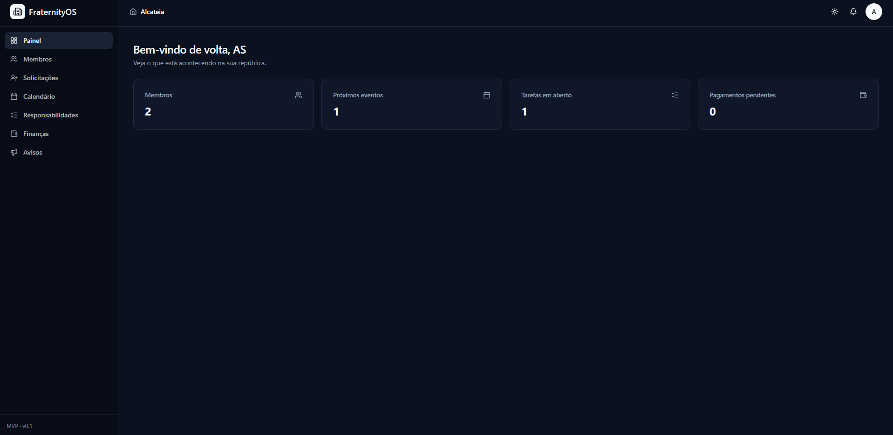
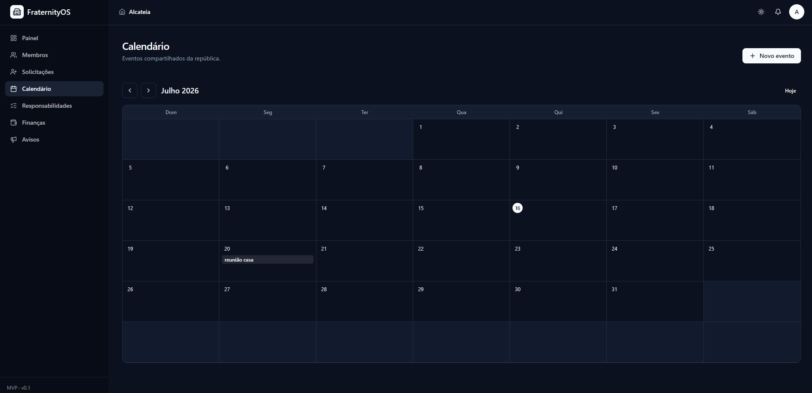
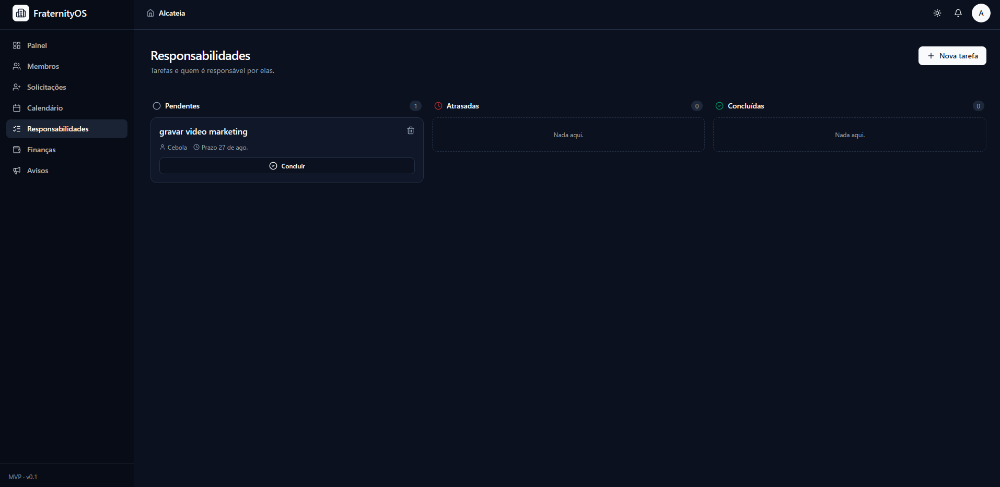
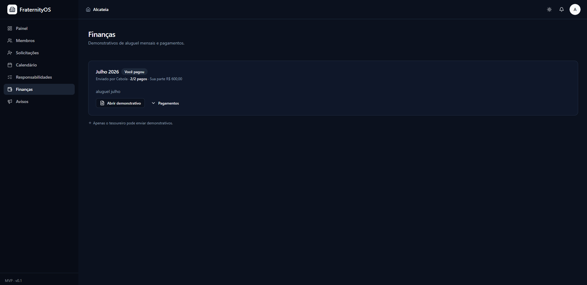
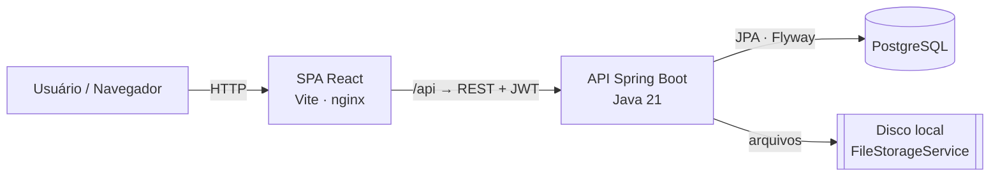

# FraternityOS

> Uma plataforma web para gerenciar as operações de uma república — membros, cargos, avisos, calendário compartilhado, tarefas e demonstrativos de aluguel mensais — substituindo o fluxo de WhatsApp + planilhas por um único painel.

<!-- Atualize owner/repo se o seu remoto for diferente. -->


O FraternityOS é uma aplicação full-stack: uma API REST em **Spring Boot** e uma SPA em **React** separada. A autenticação é baseada em JWT e a autorização é **derivada dos cargos** que um membro possui (Presidente / Tesoureiro concedem permissões). A interface está em **português (BR)**.

---

## 📸 Capturas de tela

> Coloque os PNGs nestes caminhos (`docs/screenshots/`) para que apareçam aqui.

| Painel | Calendário |
|---|---|
|  |  |

| Responsabilidades | Finanças |
|---|---|
|  |  |

---

## 🏗 Arquitetura

Duas camadas: uma SPA React conversa com a API Spring Boot via REST usando um token JWT (bearer). Sem SSR, sem servidor compartilhado. Em produção a SPA é servida pelo nginx, que também faz proxy de `/api` para o backend.



- **Autorização derivada de cargos** — não há coluna `role`; o JWT carrega os nomes dos cargos e um filtro mapeia `President → ROLE_PRESIDENT`, `Treasurer → ROLE_TREASURER`, qualquer membership → `ROLE_RESIDENT`. Os endpoints são protegidos com `@PreAuthorize`.
- **Multitenancy** — toda linha de domínio pertence a uma `HOUSE` e referencia uma `MEMBERSHIP`; as consultas são escopadas por `house_id`, derivado do principal autenticado (nunca da entrada do cliente).
- **DDD leve** — pacote por bounded context, cada um dividido em `domain` / `application` / `infrastructure` / `api`; as dependências apontam para dentro.

Veja [`project-scope.md`](project-scope.md) para a especificação do produto e o modelo de dados completo, e [`CLAUDE.md`](CLAUDE.md) para arquitetura e convenções de código.

---

## ✨ Funcionalidades

- ✅ **Autenticação JWT** — cadastro próprio (apenas conta), login com e-mail/senha, tokens HS256 stateless
- ✅ **RBAC** — cargos derivados de posições (Presidente / Tesoureiro / Residente) aplicados com `@PreAuthorize`
- ✅ **Onboarding** — criar uma república (virar Presidente) ou solicitar entrada → aprovação do Presidente
- ✅ **Gestão de membros** — membros ativos e ex-membros, atribuir/remover cargos do catálogo, mudança de status (exclusão suave = aposentar), aprovação de solicitações de entrada, invariante "sempre ao menos um Presidente ativo"
- ✅ **Avisos** — mural de notícias da república com fixação (Presidente publica, todos leem)
- ✅ **Calendário** — calendário mensal compartilhado (Presidente edita, residentes leem)
- ✅ **Tarefas / Responsabilidades** — quadro Pendentes / Atrasadas / Concluídas; status ATRASADA derivado na leitura
- ✅ **Finanças** — o Tesoureiro envia um demonstrativo de aluguel mensal (PDF/imagem) que gera um pagamento PENDENTE para cada membro ativo; cada membro marca o seu como pago

---

## 🧰 Tecnologias

**Backend**
- Java 21 · Spring Boot 3.5 · Spring Data JPA · Spring Security + JWT (jjwt)
- PostgreSQL · migrações **Flyway** · Maven
- Uploads de arquivo em disco local por trás de um `FileStorageService` (substituível por S3)

**Frontend**
- React 19 · **TypeScript** · Vite · React Router · TanStack Query
- Tailwind CSS v4 · Shadcn/UI · axios

**Testes & DevOps**
- **JUnit 5** + Mockito (unitário) · **Testcontainers** PostgreSQL (integração + repositório)
- **Docker** (imagem multi-stage do backend, imagem nginx do frontend, `docker-compose`)
- CI com **GitHub Actions** (testes · lint · build das imagens)

_Planejado:_ documentação OpenAPI/Swagger, um worker `@Scheduled` para tarefas rotativas, notificações.

---

## 🚀 Como começar

### Pré-requisitos
- **Docker** (Desktop ou Engine) — necessário para o stack completo e para os testes com Testcontainers do backend
- Para desenvolvimento local sem containers: **Java 21**, **Node 22+**

### Opção A — Rodar tudo com Docker Compose

```bash
# a partir da raiz do repositório
cp .env.example .env          # depois defina um JWT_SECRET forte
docker compose up --build
```

- Frontend → http://localhost:5173
- Backend  → http://localhost:8080
- PostgreSQL → localhost:5432 (`fraternityos` / `postgres` / `postgres`)

### Opção B — Desenvolvimento local (hot reload)

```bash
# 1. Banco de dados
docker compose up -d postgres

# 2. Backend (a partir de server/) — o Flyway migra ao iniciar
cd server && ./mvnw spring-boot:run

# 3. Frontend (a partir de frontend/) — o Vite faz proxy de /api → :8080
cd frontend && npm install && npm run dev
```

Depois abra http://localhost:5173, **cadastre-se** e crie uma república (você vira Presidente) ou solicite entrada em uma existente.

### Configuração

| Variável | Padrão | Observações |
|---|---|---|
| `JWT_SECRET` | segredo de dev (emite aviso) | **Defina um valor forte e único (≥32 bytes) em produção.** |
| `SPRING_DATASOURCE_URL` / `_USERNAME` / `_PASSWORD` | localhost / postgres / postgres | Sobrescritos por env no compose. |
| `FILE_STORAGE_DIR` | `uploads` | Onde os anexos dos demonstrativos são armazenados. |

---

## 🔌 Visão geral da API

Todas as rotas exigem um token `Bearer`, exceto `POST /auth/register` e `POST /auth/login`.

| Área | Endpoints |
|---|---|
| **Autenticação** | `POST /auth/register`, `POST /auth/login`, `GET /me` |
| **Repúblicas / Onboarding** | `GET /houses`, `GET /houses/search?name=`, `GET /houses/current`, `POST /houses`, `POST /houses/{id}/join-request`, `GET /houses/join-requests/mine`, `GET /houses/join-requests`, `POST /houses/join-requests/{id}/approve\|reject` |
| **Membros** | `GET /members`, `GET /members/alumni`, `GET /members/{id}`, `POST /members`, `PUT /members/{id}`, `DELETE /members/{id}`, `PATCH /members/{id}/status`, `POST /members/{id}/positions`, `DELETE /members/{id}/positions/{positionId}` |
| **Cargos** | `GET /positions` |
| **Avisos** | `GET\|POST /announcements`, `PUT\|DELETE /announcements/{id}` |
| **Calendário** | `GET\|POST /events`, `PUT\|DELETE /events/{id}` |
| **Tarefas** | `GET\|POST /chores`, `POST /chores/{id}/complete`, `DELETE /chores/{id}` |
| **Finanças** | `GET\|POST /statements`, `GET /statements/{id}/attachment`, `POST /statements/{id}/pay`, `GET /statements/{id}/payments`, `DELETE /statements/{id}` |

---

## 🧪 Testes

```bash
cd server
./mvnw test                              # suíte completa (precisa do Docker para o Testcontainers)
./mvnw test -Dtest=ChoreServiceTest      # uma única classe
```

- **Unitários** (Mockito): `AuthService`, `AnnouncementService`, `ChoreService`, `JwtService`
- **Integração** (`@SpringBootTest` + MockMvc + Testcontainers PostgreSQL): login/cadastro, RBAC de avisos
- **Repositório** (`@DataJpaTest` + Testcontainers): ordenação do feed e escopo por república (tenancy)

Frontend: `npm run lint` (oxlint) e `npm run build` (checagem de tipos + bundle).

---

## 🔄 CI

O `.github/workflows/ci.yml` roda a cada push na `main` e em todo PR:

```
backend (mvn verify + Testcontainers)   frontend (npm ci → lint → build)
                     └──────────────┬──────────────┘
                          docker (build das duas imagens)
```

---

## 📁 Estrutura do projeto

```
trackmycareer/
├─ server/              # API Spring Boot (Java 21, Maven) — DDD leve por bounded context
│  └─ src/main/resources/db/migration/   # Flyway V1 (schema), V2 (solicitações de entrada)
├─ frontend/            # SPA React + Vite (TypeScript), features/* espelham os contextos do backend
├─ docker-compose.yml   # Postgres + backend + frontend
├─ .github/workflows/   # CI com GitHub Actions
├─ project-scope.md     # especificação do produto + modelo de dados (fonte da verdade)
└─ CLAUDE.md            # arquitetura e convenções de código
```
